# Hospital Management System — System Design Diagram

## System Architecture

The diagram shows the high-level architecture of the Hospital Management System using a React frontend, an Express and Node.js backend, and a PostgreSQL database. It also shows the main backend layers, authentication flow, role-based access control, data persistence, and external user roles.

```mermaid
flowchart LR
    %% External users
    Patient[Patient]
    Doctor[Doctor]
    Receptionist[Receptionist]
    Administrator[Administrator]

    %% Client layer
    subgraph Client[Client Layer]
        Browser[Web Browser]
        Frontend[React + TypeScript Frontend]
        UI[Responsive HMS Dashboard]
        Browser --> Frontend
        Frontend --> UI
    end

    %% API layer
    subgraph API[Express API Layer — Node.js]
        Router[API Router<br/>/api/v1]
        Middleware[Express Middleware]
        Auth[JWT Authentication]
        RBAC[Role-Based Access Control]
        Validation[Zod Request Validation]
        Controller[Controllers]
    end

    %% Application layer
    subgraph Application[Application Layer]
        Services[Business Services]
        AppointmentRules[Appointment Rules<br/>Availability and Conflict Prevention]
        ClinicalRules[Clinical Record Rules<br/>Doctor and Patient Access]
        BillingRules[Billing Rules<br/>Invoice and Payment Status]
        Audit[Audit Logging]
    end

    %% Persistence layer
    subgraph Persistence[Persistence Layer]
        Repository[Repository Layer]
        Drizzle[Drizzle ORM]
        PostgreSQL[(PostgreSQL Database)]
    end

    %% User interactions
    Patient --> Browser
    Doctor --> Browser
    Receptionist --> Browser
    Administrator --> Browser

    %% Request flow
    Frontend -->|HTTPS / JSON requests| Router
    Router --> Middleware
    Middleware --> Auth
    Auth --> RBAC
    RBAC --> Validation
    Validation --> Controller
    Controller --> Services

    %% Business logic
    Services --> AppointmentRules
    Services --> ClinicalRules
    Services --> BillingRules
    Services --> Audit
    Services --> Repository

    %% Database flow
    Repository --> Drizzle
    Drizzle -->|SQL transactions| PostgreSQL
    PostgreSQL --> Drizzle
    Drizzle --> Repository
    Repository --> Services
    Services --> Controller
    Controller -->|JSON responses| Frontend

    %% Styling
    classDef external fill:#e7f7f5,stroke:#197774,stroke-width:1.5px,color:#16484e;
    classDef client fill:#eef0ff,stroke:#6651a8,stroke-width:1.5px,color:#30265f;
    classDef api fill:#fff3d4,stroke:#a37619,stroke-width:1.5px,color:#624a0e;
    classDef application fill:#e7f0ff,stroke:#3d6fa9,stroke-width:1.5px,color:#203f66;
    classDef persistence fill:#ffe7e7,stroke:#aa5a5a,stroke-width:1.5px,color:#672e35;

    class Patient,Doctor,Receptionist,Administrator external;
    class Browser,Frontend,UI client;
    class Router,Middleware,Auth,RBAC,Validation,Controller api;
    class Services,AppointmentRules,ClinicalRules,BillingRules,Audit application;
    class Repository,Drizzle,PostgreSQL persistence;
```

## Main Data Flow

1. A patient, doctor, receptionist, or administrator uses the React web interface.
2. The frontend sends an HTTPS request with a JSON body to the Express API.
3. Express middleware assigns a request ID, applies security headers, parses the request, and handles CORS.
4. JWT authentication verifies the identity of the user.
5. Role-based access control checks whether the user is allowed to perform the requested operation.
6. Zod validates the request body, route parameters, and query parameters.
7. The controller passes the validated request to the relevant service.
8. The service applies business rules for appointments, records, billing, or administration.
9. The repository uses Drizzle ORM to execute parameterized PostgreSQL queries and transactions.
10. The response returns through the same layers as a structured JSON response.
11. The frontend displays the result, error, loading state, or success notification.

## Design Principles

- **Separation of concerns:** Routing, validation, controllers, services, repositories, and database logic remain separate.
- **Role-based access:** Authorization is enforced by the Express backend, not only by frontend navigation.
- **Database integrity:** PostgreSQL constraints and transactions protect relationships and prevent invalid data.
- **Secure authentication:** Passwords are hashed with bcrypt and sessions use signed JWT access tokens.
- **Auditability:** Important security and operational events are recorded in the audit log.
- **Scalability:** The modular monolith can be extended with additional hospital modules without replacing the complete architecture.

## Technology Stack

| Layer | Technology |
|---|---|
| Presentation | React, TypeScript, Tailwind CSS |
| API | Express 5, Node.js, TypeScript |
| Validation | Zod |
| Authentication | JWT and bcrypt |
| ORM | Drizzle ORM |
| Database | PostgreSQL |
| Testing | Vitest or Jest, Supertest |
| Documentation | OpenAPI and Swagger UI |

## Scope of the First Release

The first release includes authentication, user roles, patient management, doctor management, doctor availability, appointment management, medical records, prescriptions, basic billing, dashboards, audit logging, and API documentation. Medical imaging, laboratory devices, insurance claims, telemedicine, external pharmacy integration, emergency triage, and clinical decision support remain outside the first release.

> **Note:** This is an academic Hospital Management System prototype. It must use synthetic development data and must not be presented as a certified clinical information system.

---

**Figure:** High-level system architecture of the Hospital Management System.
